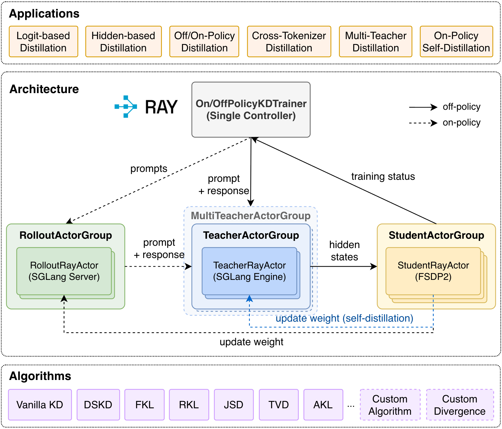
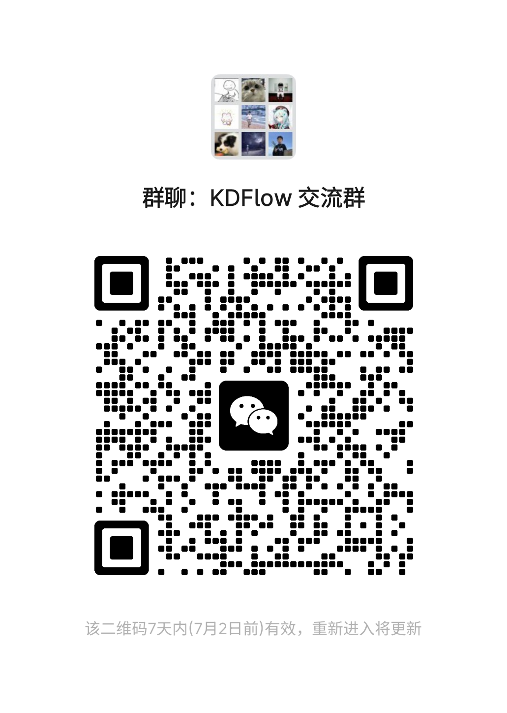

<div align="center">
  

  ### **A User-friendly and Efficient Framework for LLM Knowledge Distillation**

  [](https://github.com/songmzhang/KDFlow/releases)
  [](https://kdflow.readthedocs.io/)
  [](https://hub.docker.com/repository/docker/songmzhang/kdflow/tags)
  [](LICENSE)
  [](https://arxiv.org/abs/2603.01875)
  [](#-wechat-group)
  [](https://github.com/songmzhang/KDFlow)

</div>

---

## 🔥 News

- **[2026/06]** 🧑‍🏫 Support **multi-teacher distillation** for both off-policy and on-policy KD via `--multi_teacher_config` and per-sample `--teacher_routing_key`.
- **[2026/06]** 🐳 New Docker image based on **sglang 0.5.12 + CUDA 12.9** is now available on [Docker Hub](https://hub.docker.com/repository/docker/songmzhang/kdflow/tags) — **recommended** going forward.
- **[2026/05]** 🪄 Support **EMA teacher update** for on-policy self-distillation, enabled via `--use_ema_teacher True` and `--teacher_ema_decay <float>` (default `0.999`).
- **[2026/04]** ⚡ Support dynamic batch size (enabled via `--use_dynamic_bsz True` and `--max_token_len_per_gpu <N>`), which accelerates training by almost **60% to 100%**.
- **[2026/04]** 🎉 KDFlow v0.1.3 has been released, now supporting weight synchronization from student to teacher in on-policy self-distillation (controlled by `--teacher_update_freq`, defaults to `1` meaning the teacher is synced every global step when student and teacher share the same model path).
- **[2026/04]** 🐳 The docker image for KDFlow is now available on [Docker Hub](https://hub.docker.com/repository/docker/songmzhang/kdflow/tags), and the corresponding Dockerfile is also provided in `docker/`.
- **[2026/03]** 🎉 KDFlow v0.1.2 has been released, supporting multi-node TP/PP for extremely large teacher models.
- **[2026/03]** 💬 We have created a KDFlow WeChat group! Welcome to [join us](#-wechat-group) for discussion and communication!
- **[2026/03]** 🎉 KDFlow v0.1.1 released! Now supports **vision-language (multimodal) models** and **Qwen3.5 series**.

---

## 📑 Table of Contents

- [🔥 News](#-news)
- [✨ Key Features](#-key-features)
- [🚀 Quick Start](#-quick-start)
  - [Installation](#installation)
  - [Off-Policy Knowledge Distillation](#off-policy-knowledge-distillation)
  - [On-Policy Knowledge Distillation](#on-policy-knowledge-distillation)
  - [Multi-Teacher Distillation](#multi-teacher-distillation)
  - [Cross-Tokenizer Knowledge Distillation](#cross-tokenizer-knowledge-distillation)
  - [Supervised Fine-Tuning (SFT)](#supervised-fine-tuning-sft)
- [🔑 Design Highlights](#-design-highlights)
- [🙏 Acknowledgement](#-acknowledgement)
- [📖 Citation](#-citation)
- [📄 License](#-license)
- [💬 WeChat Group](#-wechat-group)
- [⭐ Star History](#-star-history)

---

## ✨ Key Features

- **Decoupled Infrastructure** - Using SGLang & FSDP2 for teacher inference and student training respectively.
- **Off-Policy Knowledge Distillation** — Distill from pre-collected teacher hidden states on static datasets.
- **On-Policy Knowledge Distillation** — Student-generated rollout responses are used for teacher forward and distillation training in a closed loop.
- **Cross-Tokenizer Distillation** — Native support for distilling between models with different tokenizers (e.g., Llama → Qwen).
- **Multi-Teacher Distillation** — Route each sample to a domain-specific teacher via `--multi_teacher_config` and `--teacher_routing_key`.
- **SFT Training (Black-box KD)** — Supervised fine-tuning on collected dataset.
- **MultiModal Support** — Support distillation with vision-language models (e.g., Qwen3-VL).
- **Colocate Mode** — Teacher and student models **share the same GPUs** via sleep/wakeup mechanism, maximizing GPU utilization.
- **Teacher on SGLang** — Teacher inference is powered by SGLang Engine, enabling high-throughput prefilling and flexible parallel strategies.
- **Pluggable KD Algorithms** — Built-in support for Vanilla KD and DSKD (Dual-Space Knowledge Distillation), with easy registration of custom algorithms.
- **Multiple Loss Functions** — Torch compiled KL divergence, Reverse KL divergence, JS divergence, Adaptive KL (AKL), etc.
- **Chunked Loss** — Memory-efficient loss computation that processes logits in small token chunks, avoiding full logits materialization (enabled via `--chunked_loss_size`).
- **LoRA Support** — Optional LoRA fine-tuning for the student model.
- **Wand&b Integration** — Built-in wand&b logging for experiment tracking.
- **High Training Efficiency** — Achieves **1.4x to 6x** faster distillation compared to mainstream knowledge distillation frameworks.

<p align="center">
  
</p>

---

## 🚀 Quick Start

### Installation

Install from source:

```bash
git clone https://github.com/songmzhang/KDFlow.git
cd KDFlow
pip install -e ./
# install flash attention after torch installation
pip install flash_attn==2.8.3 --no-build-isolation
```

Use the prebuilt Docker image from Docker Hub (**recommended**):

```bash
docker pull songmzhang/kdflow:sgl0512-torch211-cu129
```

> To support Qwen3.5, please use the latest version of SGLang which supports transformers v5.3.0.

> Older `sgl059-torch291-cu128` images are kept as legacy.
>
> ⚠️ **VLM users:** `sglang==0.5.9` has a known VLM compatibility bug tracked in [sglang#19335](https://github.com/sgl-project/sglang/issues/19335) and [kdflow#9](https://github.com/songmzhang/KDFlow/issues/9). For source installs, please pin `sglang>=0.5.10`.

### Off-Policy Knowledge Distillation
LLMs:
```bash
bash ./examples/off_policy_kd/run_qwen3_30b_a3b_to_4b.sh
```
VLMs:
```bash
bash ./examples/off_policy_kd/run_qwen3_vl_30b_a3b_to_4b.sh
```

### On-Policy Knowledge Distillation
LLMs:
```bash
bash ./examples/on_policy_kd/run_qwen3_30b_a3b_to_4b.sh
```
VLMs:
```bash
bash ./examples/on_policy_kd/run_qwen3_vl_30b_a3b_to_4b.sh
```

### Multi-Teacher Distillation

Multi-teacher distillation supports both off-policy and on-policy KD. Provide a JSON config that maps routing keys to teacher model paths, and make sure each training sample contains a `teacher_routing_key` value matching one of those keys.

```json
{
    "math": "Qwen3/Qwen3-14B",
    "code": "Qwen3/Qwen3-14B"
}
```

Off-policy:
```bash
bash ./examples/multi_teacher_distillation/run_multi_teacher_off_policy_distillation.sh
```

On-policy:
```bash
bash ./examples/multi_teacher_distillation/run_multi_teacher_on_policy_distillation.sh
```

See the [Multi-Teacher KD guide](docs/user_guide/multi_teacher_kd.md) for details.

### Cross-Tokenizer Knowledge Distillation

#### Off-Policy

Use SimpleCrossTokenizerKD (suggested):
```bash
bash ./examples/cross_tokenizer_kd/run_qwen3_30b_a3b_to_llama3_2_3b_offpolicy_simple_ctkd.sh
```

or DSKD:

```bash
bash ./examples/cross_tokenizer_kd/run_qwen3_30b_a3b_to_llama3_2_3b_offpolicy.sh
```

#### On-Policy

Use SimpleCrossTokenizerKD (suggested):
```bash
bash ./examples/cross_tokenizer_kd/run_qwen3_30b_a3b_to_llama3_2_3b_onpolicy_simple_ctkd.sh
```

or DSKD:

```bash
bash ./examples/cross_tokenizer_kd/run_qwen3_30b_a3b_to_llama3_2_3b_onpolicy.sh
```

### Supervised Fine-Tuning (SFT)

```bash
bash ./examples/sft/run_qwen3_4b.sh
```

---

## 🔑 Design Highlights

### GPU Co-location via Sleep/Wakeup

KDFlow enables teacher and student to **share the same GPUs** through a sleep/wakeup mechanism:

1. **Teacher phase**: Teacher model weights are loaded on GPU, student optimizer states are offloaded to CPU.
2. **Student phase**: Student optimizer states are reloaded to GPU, teacher model weights are offloaded to CPU.

This allows running large teacher models (e.g., 200B+ parameters) on the same hardware as the student without requiring separate GPU pools.

### Hidden States Transfer via Shared Memory

<p align="center">
  
</p>

Instead of transferring full teacher logits (which can be enormous for large vocabularies), KDFlow:

1. Extracts **hidden states** from the teacher's last layer via SGLang.
2. Transfers them to the student via **shared memory** (zero-copy).
3. Computes teacher logits **on the student side** using only the teacher's `lm_head` weights.

This dramatically reduces memory and communication overhead.

### Token-Based Teacher Load Balancing

The `TeacherActorGroup` uses a **greedy token-based load balancing** strategy to distribute micro-batches across teacher actors, ensuring even workload distribution when sequence lengths vary.

---

## 🙏 Acknowledgement

KDFlow is built upon the shoulders of outstanding open-source projects. We sincerely thank:

- [SGLang](https://github.com/sgl-project/sglang) — We deeply appreciate its support for extracting hidden states from model inference and its exceptional inference efficiency, which are critical to KDFlow's teacher inference pipeline.
- [OpenRLHF](https://github.com/OpenRLHF/OpenRLHF) — We gratefully adopt its well-designed abstractions for model wrapping and distributed training strategy, which form the foundation of our training infrastructure.
- [slime](https://github.com/THUDM/slime) — We appreciate its elegant implementation of Ray placement group initialization and the weight update mechanism for SGLang, which greatly inspired our design of on-policy distillation.

---

## 📖 Citation

If you find KDFlow useful in your research or work, please consider citing our paper:

```bibtex
@article{zhang2026kdflow,
  title={KDFlow: A User-Friendly and Efficient Knowledge Distillation Framework for Large Language Models},
  author={Zhang, Songming and Zhang, Xue and Zhang, Tong and Hu, Bojie and Chen, Yufeng and Xu, Jinan},
  journal={arXiv preprint arXiv:2603.01875},
  year={2026}
}
```

---

## 📄 License

This project is licensed under the [MIT License](LICENSE).

---

## 💬 WeChat Group

Welcome to join our WeChat group for discussion and communication!

<p align="center">
  
</p>

---

## ⭐ Star History

[](https://www.star-history.com/#songmzhang/KDFlow&type=date&legend=top-left)
