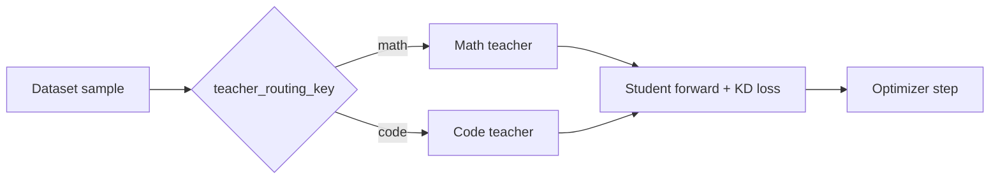

# Multi-Teacher Knowledge Distillation

Multi-teacher KD routes each sample to one of multiple teacher models. This is
useful for mixed-domain datasets, where different teachers specialize in
different domains such as math, code, or reasoning.

KDFlow supports multi-teacher distillation in both **off-policy KD** and
**on-policy KD**.



## Teacher config

Instead of passing `--teacher_name_or_path`, provide `--multi_teacher_config`, a
JSON file that maps routing keys to teacher model paths:

```json
{
    "math": "Qwen3/Qwen3-14B",
    "code": "Qwen3/Qwen3-14B"
}
```

KDFlow provides an example config at:

```bash
examples/multi_teacher_distillation/teacher_config.json
```

## Dataset format

Each training sample must contain a routing field. By default, KDFlow reads the
field named `teacher_routing_key`, and its value must match one of the keys in
`--multi_teacher_config`.

Example sample:

```json
{
    "conversations": [...],
    "teacher_routing_key": "math"
}
```

Use `--teacher_routing_key <field_name>` if your dataset uses a different field
name.

## Off-policy multi-teacher KD

Run the provided off-policy recipe:

```bash
bash examples/multi_teacher_distillation/run_multi_teacher_off_policy_distillation.sh
```

Key flags:

```bash
--multi_teacher_config examples/multi_teacher_distillation/teacher_config.json
--teacher_routing_key teacher_routing_key
--kd_algorithm vanilla_kd
--teacher_dp_size 2
--teacher_tp_size 4
--teacher_forward_n_batches 10
```

In off-policy KD, each static dataset sample is routed to the corresponding
teacher for prefill, then the teacher hidden states are transferred to the
student for KD training.

## On-policy multi-teacher KD

Run the provided on-policy recipe:

```bash
bash examples/multi_teacher_distillation/run_multi_teacher_on_policy_distillation.sh
```

Key flags:

```bash
--multi_teacher_config examples/multi_teacher_distillation/teacher_config.json
--teacher_routing_key teacher_routing_key
--kd_algorithm vanilla_kd
--rollout_num_engines 8
--rollout_tp_size 1
```

In on-policy KD, the prompt dataset provides the routing key. KDFlow keeps the
routing key with each generated rollout and sends the rollout to the matching
teacher for prefill, then the teacher hidden states are transferred to the
student for KD training.

## Notes and limitations

- `--multi_teacher_config` replaces `--teacher_name_or_path`; if both are set,
  KDFlow ignores `--teacher_name_or_path`.
- Multi-teacher KD currently only supports `--kd_algorithm vanilla_kd`.
- All teachers must share the same vocabulary as the student.

## See also

- [Off-Policy KD](off_policy_kd.md)
- [On-Policy KD](on_policy_kd.md)
- [Arguments](../reference/arguments.md)
