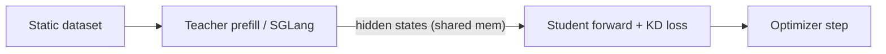

# Off-Policy Knowledge Distillation

In **off-policy KD** the training data is fixed: each batch comes from a static
dataset, and the teacher only needs to produce hidden states for the dataset
sequences (no autoregressive generation). This is the simplest and fastest KD
mode in KDFlow.



## Entry point

```bash
python -m kdflow.cli.train_kd_off_policy [args...]
```

(Run inside an environment where `ray start --head ...` has already been
executed — see the [Quickstart](../getting_started/quickstart.md).)

## Example: Qwen3-30B-A3B → Qwen3-4B (LLM)

```bash
bash examples/off_policy_kd/run_qwen3_30b_a3b_to_4b.sh
```

Key flags from the example:

```bash
# -------- Models --------
--student_name_or_path Qwen3/Qwen3-4B
--teacher_name_or_path Qwen3/Qwen3-30B-A3B
--enable_thinking      False

# -------- Training --------
--num_nodes 1  
--num_gpus_per_node 8
--backend fsdp2
--train_batch_size 128  
--micro_train_batch_size 2
--learning_rate 2e-5  
--lr_warmup_ratio 0.05  
--num_epochs 1
--bf16 True  
--gradient_checkpointing True
--enable_sleep False

# -------- Data --------
--train_dataset_path OpenLeecher/lmsys_chat_1m_clean
--input_key conversations  
--apply_chat_template True
--max_len 4096  
--packing_samples True
--preprocess_num_workers 32

# -------- Distillation --------
--kd_ratio   0.5            # loss = 0.5 * CE + 0.5 * KD
--kd_loss_fn kl             # KL divergence
--kd_algorithm vanilla_kd   # same-tokenizer vanilla KD
--teacher_dp_size 2 
--teacher_tp_size 4
--teacher_mem_fraction_static 0.4
--teacher_forward_n_batches 10
```

The total training loss is

$$
\mathcal{L} = (1 - \lambda)\,\mathcal{L}_{\text{CE}} + \lambda\,\mathcal{L}_{\text{KD}},
\qquad \lambda = \texttt{--kd\_ratio}
$$

## Example: VLM (Qwen3-VL)

A multimodal recipe is provided as well — the only differences are the dataset
keys and the VLM-aware tokenizer / processor:

```bash
bash examples/off_policy_kd/run_qwen3_vl_30b_a3b_to_4b.sh
```

See [Multimodal Distillation](multimodal.md) for what changes when the student
or teacher is a VLM.

For routing samples to multiple domain-specific teachers, see
[Multi-Teacher KD](multi_teacher_kd.md).

## What runs under the hood

1. The CLI calls `init_args("off_policy_kd")`, which parses
   `ModelArguments`, `TrainingArguments`, `FSDPArguments`,
   `DistillationArguments`, `DataArguments`, `LoggingArguments` and
   `RolloutArguments` (rollout is auto-disabled by setting
   `--rollout_num_engines 0`).
2. A placement group of `num_nodes × num_gpus_per_node` GPU bundles is created.
3. A `TeacherActorGroup` (SGLang) and a `StudentActorGroup` (FSDP2) are spawned;
   when `--enable_sleep True` they share the same physical GPUs via sleep/wakeup.
4. `OffPolicyKDTrainer.fit()` runs the loop:
   *teacher prefill → hidden-state transfer (shared memory) → student forward →
   KD loss → backward / step*.

## Tuning tips

- **`--use_dynamic_bsz True --max_token_len_per_gpu <N>`** — pack micro-batches
  by token count for ~60–100 % faster training (introduced in v0.2.0).
- **`--teacher_forward_n_batches`** — let the teacher prefill several batches
  before the student trains on them, to amortise SGLang setup cost.
- **`--teacher_quantization`** — quantise the teacher (e.g. AWQ/FP8) to fit
  larger models on the same GPUs.
- **`--teacher_pp_size` / `--teacher_tp_size`** — for very large teachers
  (200B+), KDFlow supports multi-node TP/PP since v0.1.2.
- **`--cpu_offload True`** — offload Adam optimizer states to CPU.
- **`--lora_rank R`** — enable LoRA on the student (saves a lot of optimizer
  memory; see [Arguments](../reference/arguments.md#model-arguments)).

## See also

- [On-Policy KD](on_policy_kd.md) — same recipe but with student rollouts.
- [Multi-Teacher KD](multi_teacher_kd.md) — route samples to domain-specific teachers.
- [KD algorithms](../concepts/algorithms.md) — `vanilla_kd`, `simple_ctkd`, `dskd`.
- [KD losses](../concepts/losses.md) — `kl`, `rkl`, `jsd`, `akl`, `skl`, `srkl`,
  `tvd`, `hrl`, `top1_ce`.
