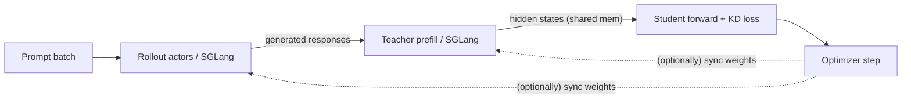

# On-Policy Knowledge Distillation

In **on-policy KD** the student generates its own rollouts, and those rollouts
are immediately fed to the teacher for distillation. This closes the loop
between *what the student would say* and *what the teacher knows*, which is
particularly useful for self-distillation and for teacher-aware refinement.



Three actor groups are involved — `RolloutActorGroup`, `TeacherActorGroup` and
`StudentActorGroup` — all sharing the same GPUs via sleep / wakeup when
`--enable_sleep True`.

## Entry point

```bash
python -m kdflow.cli.train_kd_on_policy [args...]
```

## Example: Qwen3-30B-A3B → Qwen3-4B

```bash
bash examples/on_policy_kd/run_qwen3_30b_a3b_to_4b.sh
```

Key extra flags compared to off-policy:

```bash
# -------- Rollout --------
--rollout_num_engines 8        # # of SGLang rollout engines (>0 enables on-policy)
--rollout_tp_size 1
--rollout_batch_size 1024      # prompts per rollout iteration
--n_samples_per_prompt 1
--rollout_mem_fraction_static 0.6
--generate_max_len 2048
--prompt_max_len 2048
--temperature 1.0
--top_p 1.0
--print_rollout_sample False

# Distillation knobs typically set higher kd_ratio for self-distillation
--kd_ratio   1.0
--kd_loss_fn rkl              # reverse KL is a popular choice on-policy
--kd_algorithm vanilla_kd
```

## Self-distillation: teacher-from-student weight sync

When the student and teacher start from the **same model path**, KDFlow can
periodically refresh the teacher with the student's own weights — turning the
on-policy loop into self-distillation. Two complementary knobs control this
behaviour:

```bash
--teacher_update_freq 1     # how often to push weights to the teacher (in global steps)
--use_ema_teacher    True   # push an EMA copy instead of the live student weights
--teacher_ema_decay  0.999  # EMA decay (only effective when --use_ema_teacher True)
```

### Hard sync (default)

`--teacher_update_freq N` controls **how often** the student → teacher weight
sync happens (and, transitively, the rollout engines if they share the same
checkpoint)

### EMA teacher (`--use_ema_teacher True`)

Setting `--use_ema_teacher True` makes the teacher track an
**exponential moving average** of the student instead of the latest weights.
A CPU-resident `ema_state` is initialised from the student's trainable
parameters at startup and updated as

$$
\theta_{\text{EMA}} \leftarrow \alpha \cdot \theta_{\text{EMA}} + (1 - \alpha)\,\theta_{\text{student}},
\qquad \alpha = \texttt{--teacher\_ema\_decay}
$$

When the trainer triggers a teacher weight sync (every `--teacher_update_freq`
steps), it streams `ema_state` — not the live student weights — to the teacher
actors via the same Gloo gather + CUDA IPC pipeline used by the rollout
engines. The rest of the loop is unchanged.

Tips:

- `--teacher_ema_decay` close to **1.0** (e.g. `0.999`, `0.9995`) gives a
  slow-moving, smooth teacher — usually beneficial when the student is noisy
  early on.
- A smaller decay (e.g. `0.99`) lets the teacher follow the student more
  aggressively; close to `0.0` makes EMA degenerate to a hard sync.
- EMA only adds a CPU-side parameter copy; GPU memory is unaffected.

## VLM on-policy KD

```bash
bash examples/on_policy_kd/run_qwen3_vl_30b_a3b_to_4b.sh
```

The only changes vs. LLM on-policy are the data pipeline and tokenizer/processor;
see [Multimodal Distillation](multimodal.md).

For routing rollouts to multiple domain-specific teachers, see
[Multi-Teacher KD](multi_teacher_kd.md).

## Performance notes

- **GPU co-location** — set `--enable_sleep True` so all three actor groups
  share the same GPUs.
- **Token-balanced load balancing** — the `TeacherActorGroup` greedily packs
  rollouts into per-actor token budgets so workers stay balanced even when
  sequence lengths vary widely.
- **Dynamic batching** — `--use_dynamic_bsz True --max_token_len_per_gpu <N>`
  applies on the student side just like in off-policy KD and is highly
  recommended on long sequences.
- **Larger rollout batches** improve teacher utilisation; rollout cost is
  amortised over the subsequent training steps.

## See also

- [Off-Policy KD](off_policy_kd.md)
- [Multi-Teacher KD](multi_teacher_kd.md)
- [Cross-Tokenizer KD](cross_tokenizer_kd.md) — on-policy variants are also
  supported.
- [Architecture](../concepts/architecture.md) — how the three actor groups
  interact.
